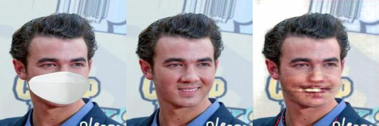

# MaskProject
## 마스크 데이터셋 만들때 참고한 것들
 * 처음 시도한 데이터셋 생성 : https://github.com/prajnasb/observations
 * 두번째 시도할 데이터셋 생성 : https://medium.com/mlearning-ai/facial-mask-overlay-with-opencv-dlib-4d948964cc4d


## 사용법
```shell
$ python3 main.py -h
```

```console
usage: main.py [-h] -m MODE [--checkpoint DIR] [--data_dir DIR] [--model_dir DIR] [--result_dir DIR]
               [--gpu GPU] [--l1_lambda Float] [--ratio Float] [--batchsize Int] [--lr Float] [--epoch Int]

optional arguments:
  -h, --help         show this help message and exit
  -m MODE            Train : Use hold-out, Test : Make image
  --checkpoint DIR   Directory of trained model
  --data_dir DIR     Dataset or Test image directory. In inference, output image will be saved here
  --model_dir DIR    Directory to save your model when training
  --result_dir DIR   Directory to save your Input/True/Generate image when training
  --gpu GPU
  --l1_lambda Float  Default is 100
  --ratio Float      Hold-out ratio, default is 0.8
  --batchsize Int    Default is 64
  --lr Float         Default is 0.0002
  --epoch Int        Default is 10
```


## 서빙할때 테스트용 모델 사용법
```shell
$ python3 main.py -m test --checkpoint checkpoint/G_4600.pt --data_dir 입력사진 
```
* 위 처럼 실행하면, 입력사진_result.jpg로 생성된 사진 나옴. 입력사진에 img.jpg라고 넣었으면 img_result.jpg가 생성되는 식

1.  이것 저것 여러 loss 추가하기 전에 기본적인 Gan+L1 Loss만 추가했을때 2 epoch 결과물


2. Perceptual Loss랑 SSIM loss 추가한 후 2 epoch 결과물 큰 차이 없는거같기도 하고, 약간 더 좋은거같기도 함

 > 문제는 Real Image가 들어가면 작동을 하지 않는다. 마스크 데이터셋 만들때 저 default 마스크가 아니면 안되는듯. 그래서 데이터셋 새로 만들 예정
