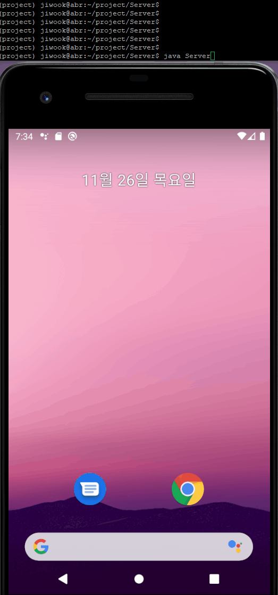

# MaskProject
## 마스크 데이터셋 만들때 참고한 것들
 * 처음 시도한 데이터셋 생성 : https://github.com/prajnasb/observations
 * 두번째 시도할 데이터셋 생성 : https://medium.com/mlearning-ai/facial-mask-overlay-with-opencv-dlib-4d948964cc4d


## 사용법
```shell
$ python3 main.py -h
```

```console
usage: main.py [-h] -m MODE [--checkpoint DIR] [--data_dir DIR] [--model_dir DIR] [--result_dir DIR]
               [--gpu GPU] [--ratio Float] [--batchsize Int] [--lr Float] [--epoch Int]

optional arguments:
  -h, --help        show this help message and exit
  -m MODE           Edit : Train edit module, Map : Train map module, Test : Make image
  --checkpoint DIR  Directory of trained model
  --data_dir DIR    Dataset or Test image directory. In inference, output image will be saved here
  --model_dir DIR   Directory to save your model when training
  --result_dir DIR  Directory to save your Input/True/Generate image when training
  --gpu GPU
  --ratio Float     Hold-out ratio, default train is 0.1
  --batchsize Int   Default is 64
  --lr Float        Default is 0.0002
  --epoch Int       Default is 500
```


## 서빙할때 테스트용 모델 사용법
```shell
$ python3 main.py -m test --checkpoint checkpoint_legacy/7200.pt --data_dir 입력사진 
```
* 위 처럼 실행하면, 입력사진_result.jpg로 생성된 사진 나옴. 입력사진에 img.jpg라고 넣었으면 img_result.jpg가 생성되는 식

## 개발 현황
1. 이것 저것 여러 loss 추가하기 전에 기본적인 Gan+L1 Loss만 추가했을때 2 epoch 결과물

<div style="text-align: center">
  
</div>

2. Perceptual Loss랑 SSIM loss 추가한 후 2 epoch 결과물 큰 차이 없는거같기도 하고, 약간 더 좋은거같기도 함

<div style="text-align: center">
   
</div>

> 문제는 Real Image가 들어가면 작동을 하지 않는다. 마스크 데이터셋 만들때 저 default 마스크가 아니면 안되는듯. 그래서 데이터셋 새로 만들 예정

3. 데이터셋을 새로 만들고, 1 epoch 학습이 너무 오래 걸려서 데이터 수를 줄여서 학습시킴

<div style="text-align: center">
  
</div>

4. 하려고 하는 것과 거의 유사한 [논문](https://ieeexplore.ieee.org/document/9019697) 발견. 구현된 코드가 없어서 논문 내용 기반으로 구현 후 모델 학습

<div style="text-align: center">
  
</div>

> 학습 도중의 D_loss로 볼 때 D가 너무 명확히 구분하는 듯. 따라서 빠른 확인을 위해 데이터 수를 더욱 줄이고 G의 학습 에폭을 늘려서 실험중 -> Mode Collapse가 일어나는 듯. 지속적으로 시도 중


## Flask를 이용한 웹 배포
* app.py를 통해 플라스크로 배포 가능


## Android Application
* Linux 서버와 Android 클라이언트간 TCP 소켓 통신

<div style="text-align: center">
   
</div>

* 사용법
```shell
$ conda activate <가상환경이름>
$ cd ./Server
$ javac Server.java
$ java Server
```
* 가상환경 activate -> Server.java가 있는 dir로 이동 -> Server.java 컴파일 -> Server 실행
* Server 실행 후 Android Application 실행
* OPEN IMAGE : 이미지 가져오기
* START : 이미지 송수신 및 모델 실행


## 여러 참고한 Github Repo
* pytorch morphological : https://github.com/lc82111/pytorch_morphological_dilation2d_erosion2d
* CycleGan, Pix2Pix : https://github.com/junyanz/pytorch-CycleGAN-and-pix2pix
* Pix2Pix : https://github.com/znxlwm/pytorch-pix2pix
* Unet : https://github.com/milesial/Pytorch-UNet
* PipeLine만들때 참고한 이전 대회 코드 : https://github.com/py-tonic/dacon_landmark
